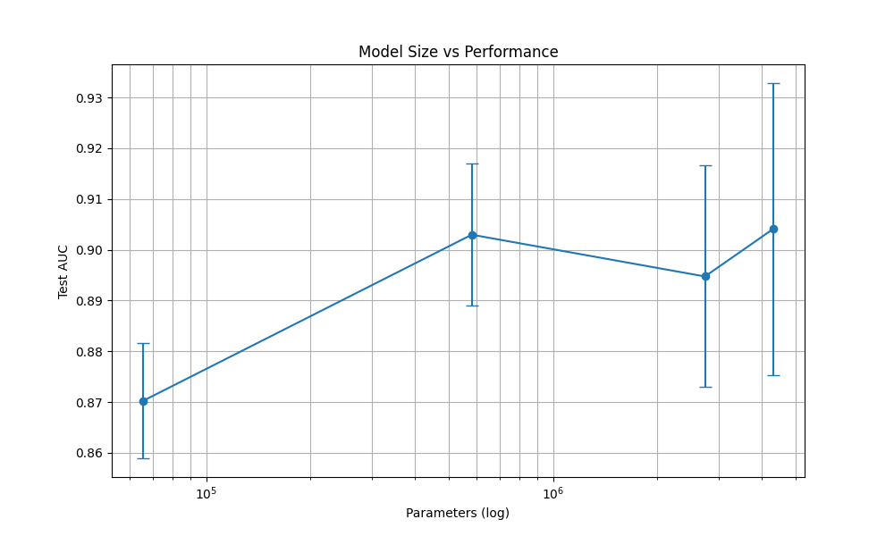
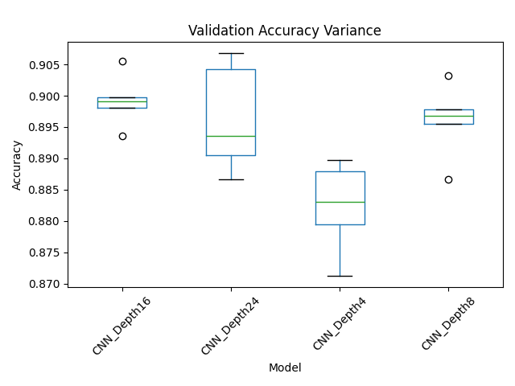

# 🔬 Architectural Depth Analysis in Medical Imaging (CNNs)

### Investigating the "Degradation Problem" in Plain CNNs for Histopathology

 
*(Representative samples from the PatchCamelyon dataset: Normal tissue vs. Metastatic tumor)*

## 📌 Project Overview
This project investigates the relationship between **network depth**, **representational capacity**, and **optimization stability** in plain Convolutional Neural Networks (CNNs). Using the **PatchCamelyon (PCam)** histopathology dataset, I designed and trained four custom CNN architectures (4, 8, 16, and 24 layers) from scratch to empirically validate the degradation problem that motivated modern architectures like ResNet.

**Key Research Question:** *At what point does adding layers to a plain CNN stop improving performance and start hurting optimization stability?*

## 🚀 Key Findings
*   **Diminishing Returns:** Performance gains plateaued sharply after **8 layers**. Increasing depth from 8 to 24 layers yielded only **+0.11% AUC** improvement despite a **7.4x increase in parameters**.
*   **Optimization Instability:** Deeper networks didn't just stop improving; they became unstable. The 24-layer model showed **2.5x higher variance** across random seeds compared to the 4-layer baseline, indicating a fragmented loss landscape.
*   **Clinical Recommendation:** The **8-layer architecture** (583K params) is the optimal choice for deployment, matching the performance of the 24-layer model (4.3M params) while being **87% smaller** and significantly more stable.

## 📊 Results Summary

| Model | Depth | Parameters | Test AUC (Mean ± Std) | Test Accuracy | F1 Score |
| :--- | :---: | :---: | :---: | :---: | :---: |
| **CNN_Depth4** | 4 | 66K | 87.03% ± 1.13 | 80.79% | 78.15% |
| **CNN_Depth8** | 8 | 583K | **90.30% ± 1.40** | 81.51% | 77.91% |
| **CNN_Depth16** | 16 | 2.7M | 89.48% ± 2.18 | 82.32% | 79.04% |
| **CNN_Depth24** | 24 | 4.3M | 90.41% ± 2.87 | **83.06%** | **80.44%** |

### Visualizations
**1. Model Complexity vs. Performance**  
*Plateauing AUC despite exponential parameter growth.*  


**2. Training Stability (Variance)**  
*Deeper networks show significantly higher variance, indicating optimization difficulties.*  


## 🛠️ Methodology
*   **Dataset:** [PatchCamelyon (PCam)](https://github.com/basveeling/pcam) - 262,144 training images (96x96px) of lymph node sections.
*   **Task:** Binary classification (Metastatic Tumor vs. Normal Tissue).
*   **Experimental Design:**
    *   **Controlled Study:** 4 architectures trained from scratch.
    *   **Robustness:** Each model trained on **5 different random seeds** (20 total full training runs).
    *   **Training:** 50 epochs, Adam optimizer, Cosine Annealing LR scheduler, Mixed Precision (FP16).
    *   **Hardware:** Custom-built workstation (NVIDIA RTX 5090 32GB, AMD Ryzen 9 7900X).

## 📂 Repository Structure
├── models/ # PyTorch model definitions (Depth4, Depth8, etc.)
├── data/ # Dataset loaders and preprocessing scripts
├── analysis/ # Visualization and analysis notebooks
├── results/ # Saved logs, metrics, and plots
│ └── plots/ # Generated figures (PNGs)
├── train.py # Main training loop
├── evaluate.py # Evaluation and testing script
└── SiddhantAggarwal_DNN_FinalReport.pdf # Full project report


## 💻 Tech Stack
*   **Deep Learning:** PyTorch, Torchvision
*   **Data Processing:** Pandas, NumPy, Scikit-Learn
*   **Visualization:** Matplotlib, Seaborn
*   **Environment:** Anaconda, Jupyter Lab

## 🔗 Connect
If you find this research interesting or have questions about the implementation, feel free to reach out!
*   **LinkedIn:** [Siddhant Aggarwal](https://www.linkedin.com/in/siddhant-aggarwal-440213196/)
*   **Email:** [Your Email Here - Optional]

---
*This project was completed as part of the Deep Neural Networks Master's course at SRH Hochschule Heidelberg.*


## Usage
```bash
# Setup
pip install -r requirements.txt

# Train models
python train.py --architecture all --seeds 42,43,44,45,46


